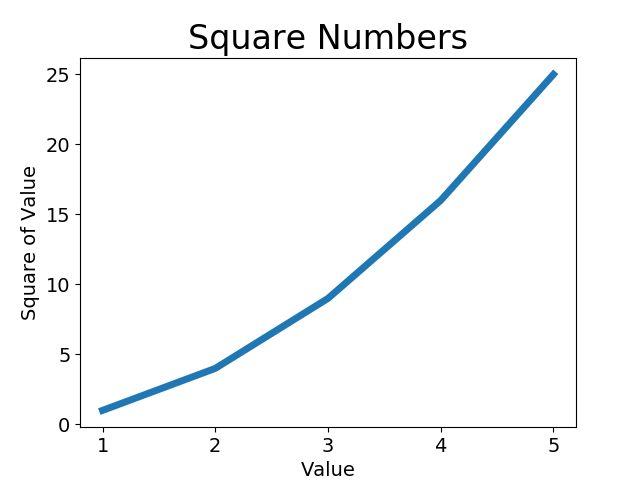
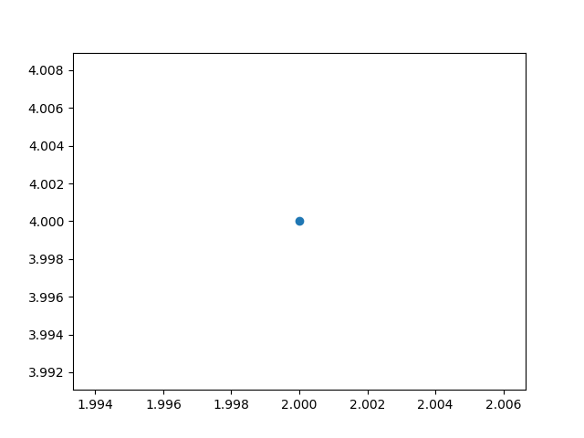

## Python文件和异常

- 文件读取
- 写入文件
- 异常处理
- 存储数据的实例

## 文件

## 1、从文件中读取数据


file_reader.py

```python
with open('./../files/pi_digits.txt') as file_object:
    content = file_object.read()
    print(content)
```


> open() 打开文件 接受一个参数 要打开的文件名称
>
> close() 关闭文件，python会再合适的时间自动将其关闭


逐行读取

```python
with open('./../files/pi_digits.txt') as file_object:
    # content = file_object.read()
    # print(content)
    # print(content.strip())
    for line in file_object:
        print(line)
        # print(line.strip())
```


使用 print(line.strip()) 去除空格


使用文件内容 pi_string.py

```python
filename = './../files/pi_digits.txt'


with open(filename) as file_object:
    lines = file_object.readlines()

pi_string = ''
for line in lines:
    pi_string += line.strip()
print(pi_string)
print(len(pi_string))
    
```


>  strip() 删除空格
>
> rstrip() 删除左边空格


### 2、写入文件


write_message.py

```python
filename = './../files/programming.txt'

with open(filename, 'w') as file_object:
    file_object.write("I love programming")
```


open()  第一个参数 文件名， 

第二个参数 'w' 以写入模式打开这个文件，可指定读取模式('r'), 写入模式('w'), 附件模式('a'), h或读取写入文件的模式('r+')。如果没有指定模式默认只读模式打开文件。


写入多行 并换行

```python
filename = './../files/programming.txt'

with open(filename, 'w') as file_object:
    file_object.write("I love programming.\n")
    file_object.write("I love creating new games.\n")
```


### 3、异常


division.py

```python
print("Give me two numbers, and I`ll divide them.")
print("Enter 'q to quit.")

while True:
    first_number = input("\nFirst number: ")
    if first_number == 'q':
        break
    second_number = input("\nSecond number: ")

    try:
        answer = int(first_number) / int(second_number)
    except ZeroDivisionError:
        print("You can`t divide by zero!")
    else:
        print(answer)
```

try except 避免程序崩溃

else 执行没有异常的代码块

pass 使代码继续执行


### 4、储存数据


使用json.dupm() 和json.load()

函数json.dump() 接受两个实参 ：要储存的数据以及可用于储存数据的文件对象


将数字串写入文件

number_writer.py


```python
import json

numbers = [2, 3, 5, 7, 11, 13]

filename = './../files/numbers.json'
with open(filename, 'w') as f_obj:
    json.dump(numbers, f_obj)
```


json.load() 加载数据


保存读数用户信息


remember_me.py

```python
import json

# 如果以前储存了用户名，就加载他
# 否则，就提醒用户输入用户名并储存它

filename = './../files/username.json'
try:
    with open(filename) as f_obj:
        username = json.load(f_obj)
except FileNotFoundError:
    username = input("what is your name? ")
    with open(filename, 'w') as f_obj:
        json.dump(username, f_obj)
        print("We`ll remember you when you come back," + username + "!")
else:
    print("Welcome back, " + username + "!")
```


重构其方法，使其更有设计感


```python
import json

# 如果以前储存了用户名，就加载他
# 否则，就提醒用户输入用户名并储存它

def get_stored_username():
    """如果以前储存了用户名，就加载他"""
    filename = './../files/username.json'
    try:
        with open(filename) as f_obj:
            username = json.load(f_obj)
    except FileNotFoundError:
        return None
    else:
        return username

def get_new_username():
    """提醒用户输入用户名"""
    username = input("what is your name? ")
    filename = './../files/username.json'
    with open(filename, 'w') as f_obj:
        json.dump(username, f_obj)
    return username

def greet_user():
    """问候用户， 并指出其名字"""
    username = get_stored_username()
    if username:
        print("Welcome back, " + username + "!")
    else:
        username = get_new_username()
        print("We`ll remember you when you come back," + username + "!")

greet_user()
```


## chapter11 测试代码


### 测试代码

### 1、测试函数

 

name_function.py

```python
def get_formatted_name(first, last):
    """生成简洁的姓名"""
    full_name = first + ' ' + last
    return full_name.title()
```


names.py 用户输入名和姓

```python
from name_function import get_formatted_name

print("Enter `q` at any time to quit.")
while True:
    first = input('\nPlease give me a first name: ')
    if first == 'q':
        break
    last = input('\nPlease give me a last name: ')
    if last == 'q':
        break

    formmatted_name = get_formatted_name(first, last)
    print("\tNeatly formatted name: " + formmatted_name + '.')
```


> python标准库中的模块unttest提供代码测试工具
>
> 良好的测试用例考虑到了函数可能收到的各种输入
>
> 对于大型项目，要实现全覆盖可能很难，通常只针对代码重要行为编写测试即可


test_name_function.py 测试单元

```python
import unittest
from name_function import get_formatted_name

class NameTestCase(unittest.TestCase):
    """测试name_function.py"""

    def test_first_last_name(self):
        """能够正确地处理像Janis Joplin这样的名字吗?"""
        formatted = get_formatted_name('janis', 'joplin')
        self.assertEqual(formatted, 'Janis Joplin')

unittest.main()
```


创建NameTestCase类，只包含一个方法，运行test_name_function.py时，以test打头的方法都将字段运行。

unittest类最常见功能 断言方法，来核实得到的结果是否与期望的结果一致

一致时输入的结果


### 2、结果分析

```

----------------------------------------------------------------------
Ran 0 tests in 0.000s

OK

Process finished with exit code 0

Empty suite

```


失败时 输出结果不同


```
----------------------------------------------------------------------
Ran 1 test in 0.000s

OK
PS C:\Users\shenshuaihu\code\PycharmProjects\crash>  py .\part1\chapter11\test_name_function.py
F
======================================================================
FAIL: test_first_last_name (__main__.NameTestCase)
能够正确地处理像Janis Joplin这样的名字吗?
----------------------------------------------------------------------
Traceback (most recent call last):
  File "C:\Users\code\PycharmProjects\crash\part1\chapter11\test_name_function.py", line 19, in test_first_last_name
    self.assertEqual(formatted, 'Janis Joplin77')
AssertionError: 'Janis Joplin' != 'Janis Joplin77'
- Janis Joplin
+ Janis Joplin77
?             ++


----------------------------------------------------------------------
Ran 1 test in 0.001s

FAILED (failures=1)

```


更改name_function.py参数时

```
def get_formatted_name(first, middle, last):
    """生成简洁的姓名"""
    full_name = first + ' ' + middle + '' + last
    return full_name.title()
```


```
----------------------------------------------------------------------
Ran 1 test in 0.000s

OK
PS C:\Users\shenshuaihu\code\PycharmProjects\crash>  py .\part1\chapter11\test_name_function.py
F
======================================================================
FAIL: test_first_last_name (__main__.NameTestCase)
能够正确地处理像Janis Joplin这样的名字吗?
----------------------------------------------------------------------
Traceback (most recent call last):
  File "C:\Users\shenshuaihu\code\PycharmProjects\crash\part1\chapter11\test_name_function.py", line 19, in test_first_last_name
    self.assertEqual(formatted, 'Janis Joplin77')
AssertionError: 'Janis Joplin' != 'Janis Joplin77'
- Janis Joplin
+ Janis Joplin77
?             ++


----------------------------------------------------------------------
Ran 1 test in 0.001s

FAILED (failures=1)
PS C:\Users\code\PycharmProjects\crash>  py .\part1\chapter11\test_name_function.py
E
======================================================================
ERROR: test_first_last_name (__main__.NameTestCase)
能够正确地处理像Janis Joplin这样的名字吗?
----------------------------------------------------------------------
Traceback (most recent call last):
  File "C:\Users\shenshuaihu\code\PycharmProjects\crash\part1\chapter11\test_name_function.py", line 18, in test_first_last_name
    formatted = get_formatted_name('janis', 'joplin')
TypeError: get_formatted_name() missing 1 required positional argument: 'last'

----------------------------------------------------------------------
Ran 1 test in 0.001s

FAILED (errors=1)

```


---


### 3、调查问卷测试实例

survey.py  匿名调查类

```python
"""
======================
@title: survey
@description: 匿名调查类
@author: elijah
@date: 2022/9/7 22:36
=====================
"""

class AnonymousSurvey():
    """手机匿名调查问卷的答案"""

    def __init__(self, question):
        """储存一个问题，并为存储答案做准备"""
        self.question = question
        self.responses = []

    def show_question(self):
        """显示调查问卷"""
        print(self.question)

    def store_response(self, new_response):
        """存储单份调查答案"""
        self.responses.append(new_response)

    def show_resulte(self):
        """显示收集到的所以答案"""
        print("Survey results:")
        for respones in self.responses:
            print("- " + respones)
```


language_survey.py 语言调查

```python
"""
======================
@title: language_survey
@description: 调查问卷
@author: elijah
@date: 2022/9/7 22:52
=====================
"""

from survey import AnonymousSurvey

# 定义一个问题，并创建一个表示调查的AnonymousSurvey对象
question = "What language did you first learn to speak?"
my_servey = AnonymousSurvey(question)

# 显示问题并储存答案
my_servey.show_question()
print("Enter `q` at any time to quit.\n")
while True:
    resource = input("Language: ")
    if resource == 'q':
        break
    my_servey.store_response(resource)

# 显示调查结果
print("\nThank you to everyone who participated in the survey!")
my_servey.show_resulte()
```


测试用例

```python
"""
======================
@title: test_survey
@description: 测试问卷用例
@author: elijah
@date: 2022/9/7 23:00
=====================
"""

import unittest
from survey import AnonymousSurvey

class TestAnonymousSurvey(unittest.TestCase):
    """针对AnonymousSurvey类的测试"""


"""
======================
@title: test_survey
@description: 测试问卷用例
@author: elijah
@date: 2022/9/7 23:00
=====================
"""

import unittest
from survey import AnonymousSurvey

class TestAnonymousSurvey(unittest.TestCase):
    """针对AnonymousSurvey类的测试"""


    def test_store_single_response(self):
        """测试单个答案会被妥善地储存"""
        question = "What language did you first learn to speak?"
        my_survey = AnonymousSurvey(question)
        my_survey.store_response('English')

        self.assertIn('English', my_survey.responses)

    def test_store_three_response(self):
        """测试三个答案会被妥善地储存"""
        question = "What language did you first learn to speak?"
        my_survey = AnonymousSurvey(question)
        respones = ['English', 'Spanish', 'Chinese']
        for respone in respones:
            my_survey.store_response(respone)

        for respone in respones:
            self.assertIn(respone, my_survey.responses)


unittest.main
```


### 4、方法setUp() 使用

创建对象


```ptyhon

import unittest
from survey import AnonymousSurvey

class TestAnonymousSurvey(unittest.TestCase):
    """针对AnonymousSurvey类的测试"""
    
# def test_store_single_response(self):
#     """测试单个答案会被妥善地储存"""
#     question = "What language did you first learn to speak?"
#     my_survey = AnonymousSurvey(question)
#     my_survey.store_response('English')
#
#     self.assertIn('English', my_survey.responses)
#
# def test_store_three_response(self):
#     """测试三个答案会被妥善地储存"""
#     question = "What language did you first learn to speak?"
#     my_survey = AnonymousSurvey(question)
#     respones = ['English', 'Spanish', 'Chinese']
#     for respone in respones:
#         my_survey.store_response(respone)
#
#     for respone in respones:
#         self.assertIn(respone, my_survey.responses)

def setUp(self):
    """
    创建一个调查对象和一组答案， 供使用的测试方法使用
    :return:
    """
    question = "What language did you first learn to speak?"
    self.my_survey = AnonymousSurvey(question)
    self.response = ['English', 'Spanish', 'Chinese']

def test_store_single_response(self):
    """测试单个答案会被妥善地储存"""
    self.my_survey.store_response(self.response[0])
    self.assertIn('English', self.my_survey.responses)

def test_store_three_response(self):
    """测试三个答案会被妥善地储存"""
    for respone in self.response:
        self.my_survey.store_response(respone)

    for respone in self.response:
        self.assertIn(respone, self.my_survey.responses)
```


更为简洁的测试， 解决重复问题


> 测试也是为了减少对项目的破坏
>
> 如果你编写的代码通过了测试，其他程序员也更远和你合作


```
2022/09/07
成都封锁一周整
3天+3天
现在来看遥遥无期
或者和上海一年，成都人也无法做自己的主了...
```


## Alien invasion外星人入侵


### 武装飞船

#### 1、规划项目

开发大型项目时，做好规划后再动手编写项目很重要。规划可确保你不偏离轨道，从而提高项目成功的可能性。

开发出来的效果

在游戏《外星人入侵》中，玩家控制着一艘最初出现在屏幕底部中央的飞船。玩家可以使用箭头键左右移动飞船，还可以使用空格键进行射击。

游戏开始时，一群外星人出现在天空中，他们在屏幕中向下移动。玩家的任务是射杀这些外星人。


#### 2、安装Pygame

使用pip安装python包

```shell
# 安装pip window和osx下载方式不同
python get-pip.py

# 使用 pip 下载pygame 
python -m pip install --user pygame  


```


#### 3、开始游戏项目

##### 创建Pygame窗口以及响应用户输入

创建空的Pygame的窗口，编写游戏基本结构

- 初始化背景设置
- 游戏主体
- 监听事件等


alien_invasion.py

```python
import sys
import pygame

def run_game():
    # 初始化游戏并创建一个屏幕对象
    pygame.init()
    screen = pygame.display.set_mode((1200, 800))
    pygame.display.set_caption("Alien Invasion")

    # 开始游戏的主循环
    while True:

        # 监视键盘和鼠标事件
        for event in pygame.event.get():
            if event.type == pygame.quit():
                sys.exit()

        # 让最近绘制的屏幕可见
        pygame.display.flip()


run_game()
```


##### 设置背景色

Pygame默认创建黑色屏幕


```

# 设置背景色 浅灰色
bg_color = (230, 230, 230)
    
# 每次循环时都重绘制屏幕
screen.fill(bg_color)
```


##### 创建设置类

每次增加游戏新功能时，通常也将引入一些新设置，避免在项目中到处添加设置，项目增大时修改游戏外观更容易。要修改游戏，只需要修改settings.py的一些值，无需查找散步在文件中的不同设置。

settings.py

```python
class Settings():
    """储存《外星人入侵》的所有设置类"""

    def __init__(self):
        """初始化游戏的设置"""
        # 屏幕设置
        self.screen_width = 1200
        self.screen_height = 800
        self.bg_color = (230, 230, 230)
```


修改alien_invasion.py


```python
import sys
import pygame
from settings import Settings

def run_game():
    # 初始化游戏并创建一个屏幕对象
    pygame.init()
    ai_settings = Settings()
    screen = pygame.display.set_mode((ai_settings.screen_width, ai_settings.screen_height))
    pygame.display.set_caption("Alien Invasion")
    
    # 开始游戏的主循环
    while True:

        # 监视键盘和鼠标事件
        for event in pygame.event.get():
            if event.type == pygame.quit():
                sys.exit()

        # 每次循环时都重绘制屏幕
        screen.fill(ai_settings.bg_color)
        
        # 让最近绘制的屏幕可见
        pygame.display.flip()
```

调用pygame.init(), 再创建一个Settings实例，将其存储在变量ai_settings中


#### 4、添加飞船图像

加载一幅图像，再使用Pygame方法blit()绘制它。

可以在此网站找 https://pixabay.com/

游戏中几乎可以使用任何图像文件，单使用位图(.bmp) 文件最为简单，Pygame默认加载位图。

选择图像时尽可能选择背景透明的图像。


##### 创建Ship类

将其显示到屏幕上，它负责管理飞船的大部分行为

ship.py

```python
import pygame


class Ship():

    def __init__(self, screen):
        """初始化飞船并设置其初始值位置"""
        self.screen = screen

        # 加载飞船图像并获取其外接矩形
        self.image = pygame.image.load('images/ship.bmp')
        self.rect = self.image.get_rect()
        self.screen_rect = screen.get_rect()

        # 将每艘新飞船放在屏幕底部中央
        self.rect.centerx = self.screen_rect.centerx
        self.rect.bottom = self.screen_rect.bottom

    def blitme(self):
        """在指定位置绘制飞船"""
        self.screen.blit(self.image, self.rect)
```


`__init__()` 接受两个参数，引用self和screen，screen指定了将飞船绘制到什么地方

`pygame.image.load()` 加载图像 返回一个表示飞船的surface，存储到self.image中

`self.rect.centerx` 飞船中心的x坐标

`self.rect.bottom` 飞船下边缘的y坐标

blitme方法将图像绘制到屏幕上


##### 在屏幕上绘制飞船


alien_invasion.py


```python
import sys
import pygame
from settings import Settings
from ship import Ship


def run_game():
    # 初始化游戏并创建一个屏幕对象
    pygame.init()
    ai_settings = Settings()
    screen = pygame.display.set_mode((ai_settings.screen_width, ai_settings.screen_height))
    pygame.display.set_caption("Alien Invasion")

    # 创建一艘飞船
    ship = Ship(screen)

    # 开始游戏的主循环
    while True:

        # 监视键盘和鼠标事件
        for event in pygame.event.get():
            if event.type == pygame.QUIT:
                sys.exit()

        # 每次循环时都重绘制屏幕
        screen.fill(ai_settings.bg_color)
        ship.blitme()

        # 让最近绘制的屏幕可见
        pygame.display.flip()


run_game()
```


启动报错


```
"C:/Users/ss/code/PycharmProjects/crash/part2/alieninvasion/alien_invasion.py", line 36, in run_game
    ship.blitme()
  File "C:\Users\ss\code\PycharmProjects\crash\part2\alieninvasion\ship.py", line 29, in blitme
    self.screen_rect.blit(self.image, self.rect)
AttributeError: 'pygame.Rect' object has no attribute 'blit'

Process finished with exit code 1

```


AttributeError: 'pygame.Rect' object has no attribute 'blit'

`self.screen_rect` 即 ` screen.get_rect()` 不能加载到bilt

错误原因代码引用错，参考其他博主也是如此错的 是screen不是screen_rect

```
self.screen.blit(self.image, self.rect)
```


修改之后便可正常启动项目


#### 5、重构： 模块game_functions


在大型项目中，经常需要在添加新代码前重构既有的代码

重构旨在简化既有代码的结构，使其更容易扩展。

当前项目使用模块game_function，避免alien_invasion太长，使逻辑更容易理解。


game_function.py

隔离事件管理循环，将事件管理与游戏的其他方法分离

```python
import pygame
import sys


def check_event():
    """响应按键和鼠标事件"""
    for event in pygame.event.get():
        if event.type == pygame.QUIT:
            sys.exit()


def update_screen(ai_setting, screen, ship):
    """更新屏幕上的图像，并切换到新屏幕"""
    # 每次循环时都重绘制屏幕
    screen.fill(ai_settings.bg_color)
    ship.blitme()

    # 让最近绘制的屏幕可见
    pygame.display.flip()
```


调用game_function.py 方法

```python
import sys
import pygame
from settings import Settings
from ship import Ship
import game_functions as gf

def run_game():
    # 初始化游戏并创建一个屏幕对象
    pygame.init()
    ai_settings = Settings()
    screen = pygame.display.set_mode((ai_settings.screen_width, ai_settings.screen_height))
    pygame.display.set_caption("Alien Invasion")

    # 创建一艘飞船
    ship = Ship(screen)

    # 开始游戏的主循环
    while True:

        # 监视键盘和鼠标事件
        gf.check_event()

        gf.update_screen(ai_settings, screen, ship)


run_game()
```


#### 6、驾驶飞船

来让玩家能够左右移动飞船

在用户按左或者右箭头键时做出响应

在函数check_events() 中，指定事件类型，每次按下都被注册未一个KEYDOWN事件。

检测到KEYDOWN事件时，我们要检查按下的是否是特定的键。左、右等，就可以控制屏幕图像移动


##### 响应按键


game_function.py

按下右箭头键，就增大飞船的rect.conterx值，飞船向右移动

```python
def check_event(ship):
    """响应按键和鼠标事件"""
    for event in pygame.event.get():
        if event.type == pygame.QUIT:
            sys.exit()
        elif event.type == pygame.KEYDOWN:
            if event.type == pygame.K_RIGHT:
                # 向右移动飞船
                ship.rect.centex += 1
```


alien_invasion.py

```python
# 开始游戏的主循环
while True:
    # 监视键盘和鼠标事件
    gf.check_event(ship)

    gf.update_screen(ai_settings, screen, ship)
```


允许不断移动

玩家按住右箭头不妨时，我们希望飞船不断地向右移动，知道玩家松开为止

KEYDOWN和KEYUOP事件 键盘的按下与松开

我们用标志来实现持续移动，飞船不动时，标志moving_right将为False。

飞船的属性Ship添加一个moving_right的属性和一个为update()的方法


ship.py

```python
class Ship():

    def __init__(self, screen):
        """初始化飞船并设置其初始值位置"""
        self.screen = screen

    
        # 移动标志 鼠标按下事件
        self.moving_right = False

    def update(self):
        """根据移动标志调整飞船的位置"""
        if self.moving_right:
            self.rect.centerx += 1

     
```


alien_invasion.py

```python
def run_game():
    # 初始化游戏并创建一个屏幕对象
    pygame.init()
    ai_settings = Settings()
    screen = pygame.display.set_mode((ai_settings.screen_width, ai_settings.screen_height))
    pygame.display.set_caption("Alien Invasion")

    # 创建一艘飞船
    ship = Ship(screen)

    # 开始游戏的主循环
    while True:
        # 监视键盘和鼠标事件
        gf.check_event(ship)
        ship.update()
        gf.update_screen(ai_settings, screen, ship)


run_game()
```


当前程序，运行起来之后，按住右箭头飞船将不断向右移动，知道松开为止。（也可以移动到屏幕外表，哈哈）


##### 左右移动

同样的方式添加向作移动的逻辑

使用moving_left 


```python
def check_event(ship):
    """响应按键和鼠标事件"""
    for event in pygame.event.get():
        if event.type == pygame.QUIT:
            sys.exit()
        elif event.type == pygame.KEYDOWN:
            print("键盘事件： " + str(event.key))
            if event.key == pygame.K_RIGHT:
                # 向右移动飞船
                # ship.rect.centex += 1
                ship.moving_right = True
            if event.key == pygame.K_LEFT:
                ship.moving_left = True

        elif event.type == pygame.KEYUP:
            if event.key == pygame.K_RIGHT:
                ship.moving_right = False
            if event.key == pygame.K_LEFT:
                ship.moving_left = False
```


```python

class Ship():

    def __init__(self, screen):
        """初始化飞船并设置其初始值位置"""
        self.screen = screen

        # 移动标志 鼠标按下事件
        self.moving_right = False
        self.moving_left = False
    
    def update(self):
        """根据移动标志调整飞船的位置"""
        if self.moving_right:
            self.rect.centerx += 1
        if self.moving_left:
            self.rect.centerx -= 1
```


##### 调整飞船的速度

当前执行while循环时，飞船最多移动1像素，但在Settings类中添加属性ship_speed_factor, 用于控制飞船的速度。

在settings.py 添加属性


```python
class Settings():
    """储存《外星人入侵》的所有设置类"""

    def __init__(self):
        """初始化游戏的设置"""
        # 屏幕设置
        self.screen_width = 1000
        self.screen_height = 700
        # 灰 230, 230, 230 蓝 R:0 G:191 B:243
        self.bg_color = (0, 191, 243)
        self.bg_image = 'images/stars.bmp'

        # 飞船的设置
        self.ship_speed_factor = 1.5
```


```
class Ship():

    def __init__(self, ai_settings, screen):
        """初始化飞船并设置其初始值位置"""
        self.screen = screen
        self.ai_settings = ai_settings

        # 在飞船的属性center中储存小数值
        self.center = float(self.rect.centerx)

        # 移动标志 鼠标按下事件
        self.moving_right = False
        self.moving_left = False

    def update(self):
        """根据移动标志调整飞船的位置"""
        if self.moving_right:
            self.center += self.ai_settings.ship_speed_factor
        if self.moving_left:
            self.center -= self.ai_settings.ship_speed_factor

        # 根据self.centerx 更新rect对象
        self.rect.centerx = self.center

    def blitme(self):
        """在指定位置绘制飞船"""
        self.screen.blit(self.image, self.rect)
```


##### 限制飞船的活动范围


当前飞船无线左右移动，只要不松开键盘，可以移动到宇宙之外

```python
def update(self):
    """根据移动标志调整飞船的位置"""

    # 限制飞船活动范围
    if self.moving_right and self.rect.right < self.screen_rect.right:
        self.center += self.ai_settings.ship_speed_factor
    if self.moving_left and self.rect.left > 0:
        self.center -= self.ai_settings.ship_speed_factor
```


向右移动不能超过屏幕最大宽度，向左移动要大于1


##### 重构check_events()

把响应键按下和响应键松开独立出来


```python
def check_event(ship):
    """响应按键和鼠标事件"""
    for event in pygame.event.get():
        if event.type == pygame.QUIT:
            sys.exit()
        elif event.type == pygame.KEYDOWN:
            print("键盘事件： " + str(event.key))
            check_keydown_event(event, ship)
        elif event.type == pygame.KEYUP:
            check_keyup_event(event, ship)


def check_keydown_event(event, ship):
    """键盘按下"""
    if event.key == pygame.K_RIGHT:
        # 向右移动飞船
        # ship.rect.centex += 1
        ship.moving_right = True
    if event.key == pygame.K_LEFT:
        ship.moving_left = True


def check_keyup_event(event, ship):
    """键盘松开"""
    if event.key == pygame.K_RIGHT:
        ship.moving_right = False
    if event.key == pygame.K_LEFT:
        ship.moving_left = False
```

#### 7、简单回顾

4个py文件，作别作用

alien_invasion.py 

主文件，整个游戏都要用到，包含游戏主题循环，调用check_enets(),  ship.update()的while循环

其他文件也是直接或者间接引入

settings.py 包含Settings类，初始化控制游戏外观和飞船速度的属性

game_function.py 包含一系列函数，游戏大部分工作都是他们完成的。

检测事件check_enevts

#### 8、射击

玩家按空格键时发射子弹（小矩形）。子弹将在屏幕中向上穿行，抵达屏幕上边缘后消失。


##### 添加子弹设置

settings.py

```python
# 子弹的设置
self.bullet_speed_factor = 1
self.bullet_width = 3
self.bullet_height = 15
self.bullet_color = 60, 60, 60
```

创建宽3像素，高15像素的深灰色子弹，子弹的速度比飞船稍低


##### 创建Bullet类

bullet.py


```python
import pygame
from pygame.sprite import Sprite


class Bullet(Sprite):
    """一个对飞船发射的子弹进行管理的类"""

    def __init__(self, ai_settings, screen, ship):
        """在飞船所处的位置创键一个子弹"""
        super(Bullet, self).__init__()
        
        self.screen = screen

        # 在（0，0）处创建一个表示子弹的矩形，再设置正确的位置
        self.rect = pygame.Rect(0, 0, ai_settings.bullet_width, ai_settings.bullet_height)
        self.rect.centerx = ship.rect.centerx
        self.rect.top = ship.rect.top

        # 存储用小数表示的子弹位置
        self.y = float(self.rect.y)

        self.color = ai_settings.bullet_color
        self.speed_factor = ai_settings.bullet_speed_

    def update(self):
        """向上移动子弹"""
        # 更新表示子弹位置的小数值
        self.y -= self.speed_factor
        # 更新表示子弹的rect的位置
        self.rect.y = self.y

    def draw_bullet(self):
        """在屏幕上绘制子弹"""
        pygame.draw.rect(self.screen, self.color, self.rect)
```


Bullet类继承Sprite类，通过使用精灵将游戏元素编组，同时操作编组中的所有元素。调用super().__init()来继承Sprite。

创建的子弹属性rect，并非基于图像，使用pagame.Rect()类从空白开始创建一个矩形。创建实例时，必须提供矩形左上角的x，y坐标和矩形的宽度高度，在(0,0)处创建这个矩形，再将其移到正确的位置

子弹的centerx设置为飞船的rect.centerx。子弹从飞船顶部射出，子弹的rect的top属性为飞船的rect的top属性，这样子弹看起来就像是从飞船中射出来的

方法update()管理子弹的位置。放射出去后，子弹在屏幕中向上移动，y坐标将不断减少，来更新子弹的位置，self.y中减去self.speed_factor的值。子弹发射后，x坐标始终不变，子弹沿直线垂直地往上穿行。


##### 将子弹存储到编组中

创建编组group，用于储存所有有效的子弹，以便于能后管理发射出去的所有字段。

编组在屏幕上绘制子弹，以及更新每颗子弹的位置


```python
from pygame.sprite import Group


def run_game():
    # 初始化游戏并创建一个屏幕对象
    pygame.init()
    ai_settings = Settings()
    screen = pygame.display.set_mode((ai_settings.screen_width, ai_settings.screen_height))
    pygame.display.set_caption("Alien Invasion")

    # 创建一艘飞船
    ship = Ship(ai_settings, screen)

    # 创建储存子弹的编组
    bullets = Group()

    # 开始游戏的主循环
    while True:
        # 监视键盘和鼠标事件
        gf.check_event(ai_settings, screen, ship, bullets)
        ship.update()
        bullets.update()
        gf.update_screen(ai_settings, screen, ship, bullets)
```


##### 开火

修改check_keydown_events() 玩家按空格键时发射一颗子弹，松开空格键时什么都不会发生。


```python
def check_event(ai_settings, screen, ship, bullets):
    """响应按键和鼠标事件"""
    for event in pygame.event.get():
        if event.type == pygame.QUIT:
            sys.exit()
        elif event.type == pygame.KEYDOWN:
            print("键盘事件： " + str(event.key))
            check_keydown_event(event, ai_settings, screen, ship, bullets)
        elif event.type == pygame.KEYUP:
            check_keyup_event(event, ship)


def check_keydown_event(event, ai_settings, screen, ship, bullets):
    """键盘按下"""
    if event.key == pygame.K_RIGHT:
        # 向右移动飞船
        # ship.rect.centex += 1
        ship.moving_right = True
    if event.key == pygame.K_LEFT:
        ship.moving_left = True

    if event.key == pygame.K_SPACE:
        # 创建一颗子弹， 并将其加入到编组bullets中
        new_bullet = Bullet(ai_settings, screen, ship)
        bullets.add(new_bullet)
        
def update_screen(ai_settings, screen, ship, bullets):
    """更新屏幕上的图像，并切换到新屏幕"""
    # 每次循环时都重绘制屏幕
    screen.fill(ai_settings.bg_color)

    # 添加背景
    bg_image = pygame.image.load(ai_settings.bg_image).convert()
    screen.blit(bg_image, (0, 0))

    # 在飞船和外星人后面重新绘制子弹
    for bullet in bullets.sprites():
        bullet.draw_bullet()        
```


启动报错,查看Bullet类是否有初始化，调用super()继续Sprite

```
 File "C:\Users\shenshuaihu\lib\site-packages\pygame\sprite.py", line 160, in add_internal
    self.__g[group] = 0
AttributeError: 'Bullet' object has no attribute '_Sprite__g'
```


##### 删除以消失的子弹

当子弹到达屏幕顶端后消失，不仅仅是Pygame不能在屏幕绘制他们，子弹实际依然存在，y坐标为负数，越来越少。他们继续消耗内存

如不删除的话，游戏的无谓工作越来越多，进而变得越来越慢。

子弹的rect的bottom属性为零时，表面以及穿过屏幕顶端了


```
def run_game():
    # 初始化游戏并创建一个屏幕对象
    
    ....

    # 创建储存子弹的编组
    bullets = Group()

    # 开始游戏的主循环
    while True:
        # 监视键盘和鼠标事件
        gf.check_event(ai_settings, screen, ship, bullets)
        ship.update()
        bullets.update()

        # 删除已消失的子弹
        for bullet in  bullets.copy():
            if bullet.rect.bottom <= 0:
                bullets.remove(bullet)
        gf.update_screen(ai_settings, screen, ship, bullets)


run_game()
```


限制子弹数量

对屏幕上子弹数量进行限制，鼓励玩家有目标的射击

settings.py

```python
self.bullets_allowed = 3
```


```python
def check_keydown_event(event, ai_settings, screen, ship, bullets):
    """键盘按下"""
    if event.key == pygame.K_RIGHT:
        # 向右移动飞船
        # ship.rect.centex += 1
        ship.moving_right = True
    if event.key == pygame.K_LEFT:
        ship.moving_left = True

    if event.key == pygame.K_SPACE:
        # 创建一颗子弹， 并将其加入到编组bullets中
        if len(bullets) < ai_settings.bullets_allowed:
            new_bullet = Bullet(ai_settings, screen, ship)
            bullets.add(new_bullet)
```


##### 创建函数

update_bullets()

子弹管理代码独立


game_funcitions.py

```python
def update_bullets(bullets):
    """更新子弹的位置，并删除已消失的子弹"""
    bullets.update()

    # 删除已消失的子弹
    for bullet in bullets.copy():
        if bullet.rect.bottom <= 0:
            bullets.remove(bullet)
```


alien_invasion.py

```python
# 开始游戏的主循环
while True:
    # 监视键盘和鼠标事件
    gf.check_event(ai_settings, screen, ship, bullets)
    ship.update()
    gf.update_bullets(bullets)

```


fire_bullet()

发射子弹的代码移动到一个独立的函数中


### 外星人

项目第二篇，从屏幕上方边缘添加一个外星人，然后生成一群外星人，外星人向两边和下面移动，并删除被子弹击中的外星人，最后，我们将显示玩家拥有飞船的数量，在玩家的飞船用完之后变结束游戏。


#### 创建一个外星人

在平时上放置类似飞船的，创建Alien类，像Ship那样的。


##### 创建alien类

alien.py


```python
"""
======================
@title: game_functions
@description: 游戏方法
@author: elijah
@date: 2022/9/9 10:10
=====================
"""

import pygame
import sys
from bullet import Bullet


def check_event(ai_settings, screen, ship, bullets):
    """响应按键和鼠标事件"""
    for event in pygame.event.get():
        if event.type == pygame.QUIT:
            sys.exit()
        elif event.type == pygame.KEYDOWN:
            print("键盘事件： " + str(event.key))
            check_keydown_event(event, ai_settings, screen, ship, bullets)
        elif event.type == pygame.KEYUP:
            check_keyup_event(event, ship)


def check_keydown_event(event, ai_settings, screen, ship, bullets):
    """键盘按下"""

    if event.key == pygame.K_q:
        sys.exit()

    if event.key == pygame.K_RIGHT:
        # 向右移动飞船
        # ship.rect.centex += 1
        ship.moving_right = True
    if event.key == pygame.K_LEFT:
        ship.moving_left = True

    if event.key == pygame.K_SPACE:
        # 创建一颗子弹， 并将其加入到编组bullets中
        fire_bullet(ai_settings, screen, ship, bullets)
    if event.key == pygame.K_RETURN:
        # 加大活力
        fire_full_bullet(ai_settings, screen, ship, bullets)


def check_keyup_event(event, ship):
    """键盘松开"""
    if event.key == pygame.K_RIGHT:
        ship.moving_right = False
    if event.key == pygame.K_LEFT:
        ship.moving_left = False


def update_screen(ai_settings, screen, ship, alien, bullets):
    """更新屏幕上的图像，并切换到新屏幕"""
    # 每次循环时都重绘制屏幕
    screen.fill(ai_settings.bg_color)

    # 添加背景
    bg_image = pygame.image.load(ai_settings.bg_image).convert()
    screen.blit(bg_image, (0, 0))

    # 在飞船和外星人后面重新绘制子弹
    for bullet in bullets.sprites():
        bullet.draw_bullet()

    ship.blitme()
    alien.blitme()

    # 让最近绘制的屏幕可见
    pygame.display.flip()


def update_bullets(bullets):
    """更新子弹的位置，并删除已消失的子弹"""
    bullets.update()

    # 删除已消失的子弹
    for bullet in bullets.copy():
        if bullet.rect.bottom <= 0:
            bullets.remove(bullet)


def fire_bullet(ai_settings, screen, ship, bullets):
    """如果没有达到限制，就发射一颗子弹"""
    # 创建一颗子弹， 并将其加入到编组bullets中
    if len(bullets) < ai_settings.bullets_allowed:
        new_bullet = Bullet(ai_settings, screen, ship)
        bullets.add(new_bullet)


def fire_full_bullet(ai_settings, screen, ship, bullets):
    """加大火力"""
    # 创建一颗子弹， 并将其加入到编组bullets中
    i = 0
    while i < 80:
        # new_ship = ship.copy()
        # new_ship.rect.centerx = ship.rect.centerx
        ai_settings.ship_full_fire = True
        ai_settings.ship_full_fire_num = i * 2 + i

        new_bullet = Bullet(ai_settings, screen, ship)
        bullets.add(new_bullet)
        i += 1
```


##### 创建Alien实例

在alien_invasion.py 中创建Alien实例


```python

from alien import Alien


def run_game():
    # 初始化游戏并创建一个屏幕对象
   
   ...

    # 创建一艘飞船
    ship = Ship(ai_settings, screen)

    # 创建储存子弹的编组
    bullets = Group()

    # 创建一个外星人
    alien = Alien(ai_settings, screen)

    # 开始游戏的主循环
    while True:
        # 监视键盘和鼠标事件
        gf.check_event(ai_settings, screen, ship, bullets)
        ship.update()
        gf.update_bullets(bullets)
        gf.update_screen(ai_settings, screen, ship, alien, bullets)


run_game()
```


在外星人出现在屏幕上


game_funcitons.py


```python
def update_screen(ai_settings, screen, ship, alien, bullets):
    """更新屏幕上的图像，并切换到新屏幕"""
    # 每次循环时都重绘制屏幕
    screen.fill(ai_settings.bg_color)

    # 添加背景
    bg_image = pygame.image.load(ai_settings.bg_image).convert()
    screen.blit(bg_image, (0, 0))

    # 在飞船和外星人后面重新绘制子弹
    for bullet in bullets.sprites():
        bullet.draw_bullet()

    ship.blitme()
    alien.blitme()

    # 让最近绘制的屏幕可见
    pygame.display.flip()
```


启动项目，第一个外星人变出现了


#### 创建一群外星人


##### 简单计算空间

首先需要确定一行可以容纳多少个外星人

屏幕的宽度为ai_setting.screen_width，但屏幕两边需要留空白，两个外边距，放置外星人的水平空间为屏幕宽度减去外星人宽度的两倍

available_space_x = ai_setting.screen_width - (2 * alien_width)

外星人直接也需要流出空白，一个外星人水平需要的宽度是两个外星人的宽度，一行容纳多少外星人可以 可利用空间除以一个外星人的宽度

number_aliens_x = available_space_x  /  (2 * alien_width)


##### 创建多行外星人

先创建aliens的编组，用于储存外星人，再调用创建函数create_fleet


alien_invasion.py

```python
def run_game():
    # 初始化游戏并创建一个屏幕对象
   ...

    # 创建一艘飞船
    ship = Ship(ai_settings, screen)

    # 创建储存子弹的编组
    bullets = Group()

    # 一个外星人编组
    aliens = Group()

    # 创建外星人群
    gf.create_fleet(ai_settings, screen, aliens)

    # 开始游戏的主循环
    while True:
        # 监视键盘和鼠标事件
        ....
        gf.update_screen(ai_settings, screen, ship, aliens, bullets)


run_game()
```


game_funcitons.py的update_screen() 修改参数名称 aliens

##### 创建外星人群


```python
def create_fleet(ai_settings, screen, aliens):
    """创建外星人舰队"""

    # 创建一个外星人 并计算一行容纳多少人外星人
    # 外星人间距为外星人宽度
    alien = Alien(ai_settings, screen)
    alien_width = alien.rect.width
    available_space_x = ai_settings.screen_width - 2 * alien_width
    number_aliens_x = int(available_space_x / (2 * alien_width))

    # 创建一行外星人
    for alien_number in range(number_aliens_x):
        # 创建一个外星人并将其加入当前行
        alien = Alien(ai_settings, screen)
        alien.x = alien_width + 2 * alien_width * alien_number
        alien.rect.x = alien.x
        aliens.add(alien)
```


新增运行游戏即可以看到一行外星人了


##### 重构create_fleet()

创建两个新函数

game_functions.py


```python
def create_fleet(ai_settings, screen, aliens):
    """创建外星人舰队"""

    # 创建一个外星人 并计算一行容纳多少人外星人
    # 外星人间距为外星人宽度
    alien = Alien(ai_settings, screen)
    alien_width = alien.rect.width
    number_aliens_x = get_number_aliens_x(ai_settings, alien_width)

    # 创建一行外星人
    for alien_number in range(number_aliens_x):
        # 创建一个外星人并将其加入当前行
        create_alien(ai_settings, screen, aliens, alien_number)


def get_number_aliens_x(ai_settings, alien_width):
    """计算每行容纳多少外星人"""
    available_space_x = ai_settings.screen_width - 2 * alien_width
    number_aliens_x = int(available_space_x / (2 * alien_width))
    return number_aliens_x

def create_alien(ai_settings, screen, aliens, alien_number):
    """创建一个外星人并将其放在当前行"""
    alien = Alien(ai_settings, screen)
    alien_width = alien.rect.width
    alien.x = alien_width + 2 * alien_width * alien_number
    alien.rect.x = alien.x
    aliens.add(alien)
```


##### 添加行

计算可以容纳外形人的有限高度是多少， 垂直空间，屏幕高度减去第一行外星人的上边距，飞船高度和最初外星人高度加上外星人间距

屏幕高度 - 两处留白的位置 - 第一行外星人 - 飞船

```
available_space_y = ai_settings.screen_height - (3 * alien_height) - ship_height
```

可容纳多少行

number_rows = available_space_y / (2 * alien_height)


game_functions.py


```python
def create_fleet(ai_settings, screen, ship, aliens):
    """创建外星人舰队"""

    # 创建一个外星人 并计算一行容纳多少人外星人
    # 外星人间距为外星人宽度
    alien = Alien(ai_settings, screen)
    alien_width = alien.rect.width
    number_aliens_x = get_number_aliens_x(ai_settings, alien_width)
    number_rows = get_number_rows(ai_settings, ship.rect.height, alien.rect.height)

    # 创建一群外星人
    for number_row in range(number_rows):
        for alien_number in range(number_aliens_x):
            # 创建一个外星人并将其加入当前行
            create_alien(ai_settings, screen, aliens, alien_number, number_row)


def get_number_aliens_x(ai_settings, alien_width):
    """计算每行容纳多少外星人"""
    available_space_x = ai_settings.screen_width - 2 * alien_width
    number_aliens_x = int(available_space_x / (2 * alien_width))
    return number_aliens_x


def create_alien(ai_settings, screen, aliens, alien_number, row_number):
    """创建一个外星人并将其放在当前行"""
    alien = Alien(ai_settings, screen)
    alien_width = alien.rect.width
    alien.x = alien_width + 2 * alien_width * alien_number
    alien.rect.x = alien.x
    alien.rect.y = alien.rect.height + 2 * alien.rect.height * row_number
    aliens.add(alien)


def get_number_rows(ai_settings, ship_height, alien_height):
    """计算屏幕可容纳多少行外星人"""
    # 屏幕高度 - 两处留白的位置 - 第一行外星人 - 飞船
    available_space_y = ai_settings.screen_height - (3 * alien_height) - ship_height
    number_rows = int(available_space_y / (2 * alien_height))
    return number_rows
```


创建多行时，需要两个嵌套的循环，内部循环场景一行外星人，外部循环从零数到要创建的行数


调用方法

```
# 创建外星人群
gf.create_fleet(ai_settings, screen, ship, aliens)
```

现在运行游戏变可以看到外星人。


也可以使用随机数来创建

```python
# 随机创建
random_number = randint(0, 10)
if alien_number == random_number or number_row == random_number:
    continue
```


#### 让外星人群移动

让外星人在屏幕上向右移动，撞到屏幕边缘后下移一定距离，再沿相反的方向移动。


##### 向右移动

```
 # 开始游戏的主循环
    while True:
        # 监视键盘和鼠标事件
        gf.check_event(ai_settings, screen, ship, bullets)
        ship.update()
        gf.update_bullets(bullets)
        gf.update_aliens(aliens)
        gf.update_screen(ai_settings, screen, ship, aliens, bullets)

```


game_functions.py

```

def update_aliens(aliens):
    """更新外星人群中的所有外星人位置"""
    aliens.update()
```


alien.py

```
def update(self):
    """向右移动外星人"""
    self.x += self.ai_settings.alien_speed_factor
    self.rect.x = self.x
```


settings.py

```
# 外星人设置
self.alien_speed_factor = 1
```


##### 移动方向控制


```
# 外星人设置
self.alien_speed_factor = 1
self.fleet_drop_speed = 10
# fleet_direction 为1表示向右移 -1表示向左移动
self.fleet_direction = 1
```


由于是两个方向，使用-1或者1就不会影响两个方向切换 


##### 检查是否撞到了屏幕边缘


```
def check_edges(self):
    """如果外星人位于屏幕边缘 就返回True"""
    screen_rect = self.screen.get_rect()
    if self.rect.right >= screen_rect.right:
        return True
    elif self.rect.left <= 0:
        return True

def update(self):
    """向右移动外星人"""
    self.x += (self.ai_settings.alien_speed_factor * self.ai_settings.fleet.direction)
    self.rect.x = self.x
```


##### 向下移动并改变方向


调用change_fleet_direction后，跳出循环，不然会一直向下


```python
def update_aliens(ai_settings, aliens):
    """
    检查是否有外星人位于屏幕边缘
    更新外星人群中的所有外星人位置
    """
    check_fleet_edges(ai_settings, aliens)
    aliens.update()


def check_fleet_edges(ai_settings, aliens):
    """有外星人到达边缘时采取相应的措施"""
    for alien in aliens.sprites():
        if alien.check_edges():
            change_fleet_direction(ai_settings, aliens)
            break


def change_fleet_direction(ai_settings, aliens):
    """将外星人下移并改变方向"""
    for alien in aliens.sprites():
        alien.rect.y += ai_settings.fleet_drop_speed
    ai_settings.fleet_direction *= -1
```


类似的可以做成雨点，下雨天


#### 射杀外星人

sprite.groupcollide() 将每颗子弹的rect同每个外星人rect进行比较，并返回一个字典，包含碰撞的外星人和子弹，相应的值都是被击中的外星人， 两个True是删除响应的元素，如果是高能子弹的话 第一个参数可以为false不用删除。


```
# 检查是否有子弹击中外星人 如果是这样的 删除相应的子弹和外星人
collisions = pygame.sprite.groupcollide(bullets, aliens, True, True)
```


可以改变子弹的宽度来提高射杀率

```python
self.bullet_width = 300
```


##### 生成新的外星人


```
if len(aliens) == 0:
    # 删除现有的子弹并新建一群外星人
    bullet.empty()
    create_fleet(ai_settings, screen, ship, aliens)
```


提交子弹的速度，厚礼等


重构update_bullets()


#### 结束游戏

增加趣味性

##### 检测外星人和飞船碰撞


```
def update_aliens(ai_settings, ship, aliens):
    """
    检查是否有外星人位于屏幕边缘
    更新外星人群中的所有外星人位置
    """
    ...

    # 检测外形人和飞船之间碰撞
    if pygame.sprite.spritecollideany(ship, aliens):
        print("--------------- ship hit!!! ------------------")
```


响应外星人和飞船碰撞

碰撞时，不销毁ship实例并创建一个新的ship，通过追踪游戏统计信息来记录飞船被撞的次数，便于后续记分

新建GameStats 用于跟踪游戏统计信息的类

game_stats.py


```python
class GameStats():
    """跟踪游戏的统计信息"""

    def __init__(self, ai_settings):
        """初始化统计信息"""
        self.ai_settings = ai_settings
        self.reset_stats()

    def reset_stats(self):
        """初始化在游戏运行期间可能变化信息统计"""
        self.ships_left = self.ai_settings.ship_limit
```


```
# 创建一个用于储存游戏统计信息的实例
stats = GameStats(ai_settings)

# 开始游戏的主循环
while True:
    # 监视键盘和鼠标事件
  
    gf.update_aliens(ai_settings, ship, aliens, stats)
```


响应被外星人撞到的飞船

撞击之后清空子弹和外星人， 创建新的外星人，把飞船放在屏幕中间，暂停1s

game_functions.py

```
def ship_hit(ai_settings, stats, screen, ship, aliens, bullets):
    """响应被外星人撞到的飞船"""
    # 将ships_left减1
    stats.ships_left -= 1

    # 清空外星人列表和子弹
    aliens.empty()
    bullets.empty()

    # 创建一群新的外星人 并将飞船放到屏幕底端中央
    create_fleet(ai_settings, screen, ship, aliens)
    ship.center_ship()

    # 暂停
    sleep(1)
```


```python
def update_aliens(ai_settings, stats, screen, ship, aliens, bullets):
    """
    检查是否有外星人位于屏幕边缘
    更新外星人群中的所有外星人位置
    """
    check_fleet_edges(ai_settings, aliens)
    aliens.update()

    # 检测外形人和飞船之间碰撞
    if pygame.sprite.spritecollideany(ship, aliens):
        print("--------------- ship hit!!! ------------------")
        ship_hit(ai_settings, stats, screen, ship, aliens, bullets)
```


ship.py

```
def center_ship(self):
    """让飞船在屏幕上居中"""
    self.center = self.screen_rect.centerx
```


有外星人到达屏幕底端

也做出与外星人撞击屏幕相同的响应

```python
def check_aliens_bottom(ai_settings, stats, screen, ship, aliens, bullets):
    """检查是否有外星人到达屏幕底端"""
    screen_rect = screen.get_rect()
    for alien in aliens.sprites():
        if alien.rect.bottom >= screen_rect.bottom:
            """像飞船撞击一样处理"""
            ship_hit(ai_settings, stats, screen, ship, aliens, bullets)
```


##### 游戏结束

给定一个游戏状态，飞船用完后结束游戏

game_stats.py

```
class GameStats():
    """跟踪游戏的统计信息"""

    def __init__(self, ai_settings):
        """初始化统计信息"""
        # 游戏启动处于活动状态
        self.game_active = True
```


game_function.py

```
def ship_hit(ai_settings, stats, screen, ship, aliens, bullets):
    """响应被外星人撞到的飞船"""
    if stats.ships_left > 0:
        # 将ships_left减1
        stats.ships_left -= 1
        ...
        # 暂停
        sleep(1)
    else:
        # game over
        stats.game_active = False
```


alien_invasion.py

```
    # 开始游戏的主循环
    while True:
        # 监视键盘和鼠标事件
        gf.check_event(ai_settings, screen, ship, bullets)

        if stats.game_active:
            ship.update()
            gf.update_bullets(ai_settings, screen, ship, bullets, aliens)
            gf.update_aliens(ai_settings, stats, screen, ship, aliens, bullets)

        gf.update_screen(ai_settings, screen, ship, aliens, bullets)


run_game()
```


当前游戏主体已经完成了，只是确认积分系统，游戏关卡，交互性比较好的UI。

也是托着连续失眠疲惫身体，坚持着，也盼望着可以看到我们所期待有意义的样子

2022/09/22 chengdu work in home!


---


### 记分

按键play按钮 用于启动游戏

玩家等级提高时，增加游戏节奏

实现记分系统


#### 添加Play按钮


```python
class GameStats():
    """跟踪游戏的统计信息"""

    def __init__(self, ai_settings):
        """初始化统计信息"""
        self.ships_left = None
        self.ai_settings = ai_settings
        self.reset_stats()

        # 游戏启动处于非活动状态
        self.game_active = False
```


##### 创建Button类

pygame没有内置创建按钮的方法，需要我们创建

button.py


```python
import pygame.font


class Button():

    def __init__(self, ai_settings, screen, msg):
        """初始化按钮的属性"""
        self.screen = screen
        self.screen_rect = screen.get_rect()

        # 设置按钮的尺寸和其他属性
        self.width, self.height = 200, 50
        self.button_color = (0, 255, 0)
        self.text_color = (255, 255, 255)
        self.font = pygame.font.SysFont(None, 48)

        # 创建按钮的rect对象， 使其居中
        self.rect = pygame.Rect(0, 0, self.width, self.height)
        self.rect.center = self.screen_rect.center

        # 按钮的标签只需要创建一次
        self.prep_msg(msg)

    def prep_msg(self, msg):
        """"将msg渲染为图像， 并使其在按钮上居中"""
        self.msg_image = self.font.render(msg, True, self.text_color, self.button_color)
        self.msg_image_rect = self.msg_image.get_rect()
        self.msg_image_rect.center = self.rect.center

    def draw_button(self):
        """绘制一个颜色填充的按钮， 再绘制文本"""
        self.screen.fill(self.button_color, self.rect)
        self.screen.blit(self.msg_image, self.msg_image_rect)
```


pygame.font.SysFont 字体渲染，None使用默认字体

font.render 将存储在msg中的文本转换为图像，将图像储存在msg_image中


在屏幕上绘制按钮

anlien_invasion.py

```
def run_game():
    # 初始化游戏并创建一个屏幕对象
    pygame.init()
     
    # 创建Play按钮
    play_button = Button(ai_settings, screen, "Play")

     ....

    # 创建一个用于储存游戏统计信息的实例
    stats = GameStats(ai_settings)

    # 开始游戏的主循环
    while True:
        # 监视键盘和鼠标事件
      

        gf.update_screen(ai_settings, stats, screen, ship, aliens, bullets, play_button)


run_game()
```


game_funciton.py

```
def update_screen(ai_settings, stats, screen, ship, aliens, bullets, play_button):
 
    
    # 如果游戏处于非活动状态，就绘制Play按钮
    if not stats.game_active:
        play_button.draw_button()

    # 让最近绘制的屏幕可见
    pygame.display.flip()
```


##### 开始游戏

玩家单击Play按钮时，开始新游戏，监视与这个按钮相关的鼠标事件

监听鼠标事件

game_functions.py

```python
def check_event(ai_settings, screen, stats, play_button, ship, bullets):
    """响应按键和鼠标事件"""
    for event in pygame.event.get():
        if event.type == pygame.QUIT:
            sys.exit()
        elif event.type == pygame.MOUSEBUTTONDOWN:
            # 鼠标事件
            mouse_x, mouse_y = pygame.mouse.get_pos()
            check_play_button(stats, play_button, mouse_x, mouse_y)
```


##### 重置游戏


避免play重复触发

```
def check_play_button(ai_settings, screen, stats, play_button, ship, bullets, aliens, mouse_x, mouse_y):
    """玩家单机play按钮时开始游戏"""
    button_click = play_button.rect.collidepoint(mouse_x, mouse_y)
    if button_click and not stats.game_active:

        # 重置游戏统计信息
        stats.reset_stats()
        stats.game_active = True
```


```
def check_play_button(ai_settings, screen, stats, play_button, ship, bullets, aliens, mouse_x, mouse_y):
    """玩家单机play按钮时开始游戏"""
    button_click = play_button.rect.collidepoint(mouse_x, mouse_y)
    if button_click and not stats.game_active:

        # 重置游戏统计信息
        stats.reset_stats()
        stats.game_active = True

        # 清空外星人 子弹
        aliens.empty()
        bullets.empty()

        # 创建一群新的外星人 飞船居中
        create_fleet(ai_settings, screen, ship, aliens)
        ship.center_ship()
```


##### 将Play按钮切换到非活动状态


让游戏仅在game_active为Fasle时才开始


game_function.py

```
def check_play_button(ai_settings, screen, stats, play_button, ship, bullets, aliens, mouse_x, mouse_y):
    """玩家单机play按钮时开始游戏"""
    button_click = play_button.rect.collidepoint(mouse_x, mouse_y)
    if button_click and not stats.game_active:

        # 重置游戏统计信息
        ...
```


当玩家点击了Play按钮且游戏当前处于非活动状态时，游戏才重新开始


##### 隐藏光标


游戏开始之后变隐藏起来

隐藏光标 

```
def check_play_button(ai_settings, screen, stats, play_button, ship, bullets, aliens, mouse_x, mouse_y):
    """玩家单机play按钮时开始游戏"""
    button_click = play_button.rect.collidepoint(mouse_x, mouse_y)
    if button_click and not stats.game_active:

        # 隐藏光标
        pygame.mouse.set_visible(False)
```


游戏结束飞船被击中 时 显示光标

显示光标

```
def ship_hit(ai_settings, stats, screen, ship, aliens, bullets):
    """响应被外星人撞到的飞船"""
    if stats.ships_left > 0:
        # 将ships_left减1
        ....
    else:
        # game over
        stats.game_active = False
        # 显示光标
        pygame.mouse.set_visible(True)
```


#### 提交等级

当前将整群外星人都消灭干净后，玩家将提高一个等级，即加快游戏的节奏，让游戏更难


##### 修改速度与重置速度


有个初始化速度，速度增快的节奏

提高速度，与初始化速度


```python
class Settings():
    """储存《外星人入侵》的所有设置类"""

    def __init__(self):
        """初始化游戏的设置"""
        # 屏幕设置
        .....

        # 以什么样的速度加快游戏节奏
        self.speedup_scale = 1.1

        self.initialize_dynamic_settings()

    def initialize_dynamic_settings(self):
        """初始化游戏设置"""
        self.ship_speed_factor = 1.5
        self.bullet_speed_factor = 3
        self.alien_speed_factor = 1

        # fleet_direction 为1表示向右移 -1表示向左移动
        self.fleet_direction = 1

    def increase_speed(self):
        """提高速度设置"""
        self.ship_speed_factor *= self.speedup_scale
        self.bullet_speed_factor *= self.speedup_scale
        self.alien_speed_factor *= self.speedup_scale
```


game_function.py

点击Play时


```
def start_game(ai_settings, screen, stats, ship, bullets, aliens):
    """ 开始游戏 """

    # 重置游戏设置
    ai_settings.initialize_dynamic_settings()
```


外星人被清空时

```
def check_bulled_alien_collisions(ai_settings, screen, ship, bullets, aliens):
    # 检查是否有子弹击中外星人 如果是这样的 删除相应的子弹和外星人
    collisions = pygame.sprite.groupcollide(bullets, aliens, True, True)

    if len(aliens) == 0:
        # 删除现有的子弹并新建一群外星人
        bullets.empty()
        # 提速
        ai_settings.increase_speed()
        create_fleet(ai_settings, screen, ship, aliens)
```


射击移动靶心也是如此


#### 记分


搞一个记分系统，实时跟踪玩家的得分，并显示最高得分，当前等级和余下飞船数

新建game_stats.py 


##### 显示得分

新建scoreboard.py 文件 用户记录得分相关数据


```python
import pygame.font


class Scoreboard:
    """显示得分信息的类"""

    def __init__(self, ai_settings, screen, stats):
        """初始化显示得分涉及的属性"""
        self.score_image = None
        self.score_rect = None
        self.screen = screen
        self.screen_rect = screen.get_rect()
        self.ai_setting = ai_settings
        self.stats = stats

        # 显示得分信息时使用的字体设置
        self.text_color = (30, 30, 30)
        self.font = pygame.font.SysFont(None, 48)

        # 准备初始得分图像
        self.prep_score()

    def prep_score(self):
        """将得分转换一幅渲染的图像"""
        score_str = str(self.stats.score)
        self.score_image = self.font.render(score_str, True, self.text_color, self.ai_setting.bg_color)

        # 将得分放在屏幕右上角
        self.score_rect = self.score_image.get_rect()
        self.score_rect.right = self.screen_rect.right - 20
        self.score_rect.top = self.screen_rect.top - 20


    def show_score(self):
        """在屏幕上显示得分"""
        self.screen.blit(self.score_image, self.score_rect)

```


prep_score 将显示的文本转换为图像


##### 创建记分牌

需要在alien_invasion.py 中创建一个Scoreboard实例：


```
from scoreboard import Scoreboard

def run_game():
	....
 # 创建一个用于储存游戏统计信息的实例
    stats = GameStats(ai_settings)
    sb = Scoreboard(ai_settings, screen, stats)
    
    # 开始游戏的主循环
    while True:

        gf.update_screen(ai_settings, stats, sb, screen, ship, aliens, bullets, play_button)

```


game_functions.py

```
def update_screen(ai_settings, stats, sb, screen, ship, aliens, bullets, play_button):


    # 显示得分
    sb.show_score()
```


在外星人被消灭时更新积分

每次增加50，发生子弹与外星人碰撞时更新分组，修改传递参数


```
class Settings():
    """储存《外星人入侵》的所有设置类"""

    def __init__(self):

        # 记分
        self.alien_points = 50
```


game_functions.py

```
def check_bulled_alien_collisions(ai_settings, stats, sb, screen, ship, bullets, aliens):
    # 检查是否有子弹击中外星人 如果是这样的 删除相应的子弹和外星人
    collisions = pygame.sprite.groupcollide(bullets, aliens, True, True)

    if collisions:
        stats.score += ai_settings.alien_points
        sb.prep_score()
```


##### 消灭的每个外星人都计入得分

目前一共子弹同时碰撞到多个外星人时是计算一次积分（增加字段宽度可以测试），或者两颗子弹同事击中一个外星人也会有如此的情形。


调整检测子弹和外星人碰撞的方式

```
if collisions:
    for aliens in collisions.values():
        stats.score += ai_settings.alien_points * len(aliens)
        sb.prep_score()
```


如果字典collisions存在，我们就遍历其中所有值。每个值都是一个列表，包含同一子弹击中的所有外星人，


##### 提高点数

玩家每提高一个等级，游戏都变得更难，外星人的点数也提高。


settings.py

```
     def __init__(self):

        # 外星人点数提高速度
        self.score_scale = 1.5


    def increase_speed(self):
        """提高速度设置和外星人点数"""
        

        # 分数 * 点数
        self.alien_points = int(self.alien_points * self.score_scale)
        print("alien points " + str(self.alien_points))


```


##### 将得分圆整

方便直接观看，每三位用逗号隔开

```python
rounded_score = int(round(self.stats.score, -1))
score_str = "{:,}".format(rounded_score)
```


round() 通常精确小数点后多少位，如果是负数的化，则是10，100，1000等整数倍


##### 最高得分

实现思路与得分相近，最高分来源是每次得分，而且不会被重置


game_stats.py

```
class GameStats:
    """跟踪游戏的统计信息"""

    def __init__(self, ai_settings):
        """初始化统计信息"""
        
        # .....

        # 在任何情况下都不应重制最高分
        self.high_score = 0
```


scoreboard.py

```
class Scoreboard:
    """显示得分信息的类"""

    def __init__(self, ai_settings, screen, stats):
        """初始化显示得分涉及的属性"""
        
        # ....
          # 最高分和当前得分
        self.prep_high_score()
        
     def prep_score(self):
        """将得分转换一幅渲染的图像"""
        rounded_score = int(round(self.stats.score, -1))
        score_str = "{:,}".format(rounded_score)
        
        
    def show_score(self):
        """在屏幕上显示得分"""
        self.screen.blit(self.score_image, self.score_rect)
        self.screen.blit(self.high_score_image, self.high_score_rect)


    def prep_high_score(self):
        """将最高得分转换为渲染等图像"""
        high_score = int(round(self.stats.high_score, -1))
        high_score_str = "{:,}".format(high_score)
        self.high_score_image = self.font.render(high_score_str, True, self.text_color, self.ai_setting.bg_color)

        """将最高得分放在屏幕顶部中央"""
        self.high_score_rect = self.high_score_image.get_rect()
        self.high_score_rect.right = self.screen_rect.centerx
        self.high_score_rect.top = self.screen_rect.top

        
```


game_functions.py 调用入口

```

def check_bulled_alien_collisions(ai_settings, stats, sb, screen, ship, bullets, aliens):
    # 检查是否有子弹击中外星人 如果是这样的 删除相应的子弹和外星人
    collisions = pygame.sprite.groupcollide(bullets, aliens, True, True)

    if collisions:
        for aliens in collisions.values():
            stats.score += ai_settings.alien_points * len(aliens)
            sb.prep_score()
        check_high_score(stats, sb)


def check_high_score(stats, sb):
    """检查是否诞生了新的最高分"""
    if stats.score > stats.high_score:
        stats.high_score = stats.score
        sb.prep_high_score()
```


外星人被击中时，便去调用check_high_score去检查是否诞生了新的最高分

最高分出现在中央，当前分出现在右边


##### 显示等级


首先在GameStats中添加当前等级属性，确保游戏开始时都重置

与现实得分思路相近

- 初始化等级1
- 渲染图像显示在屏幕上 prep_level
- 外星人都消灭完时，增加一个等级  check_bulled_alien_collisions
- 游戏开始play时重置等级 start_game


GameStats.py

```
def reset_stats(self):
    """初始化在游戏运行期间可能变化信息统计"""
    self.ships_left = self.ai_settings.ship_limit
    # 得分
    self.score = 0
    # 等级
    self.level = 0
```


Scoreboard.py

```

 def show_score(self):
        """在屏幕上显示得分"""
        self.screen.blit(self.score_image, self.score_rect)
        self.screen.blit(self.high_score_image, self.high_score_rect)
        self.screen.blit(self.level_image, self.level_rect)

    def prep_level(self):
        """将等级转换为渲染的图像"""
        self.level_image = self.font.render(str(self.stats.level), True, self.text_color, self.ai_setting.bg_color)

        # 将等级放在得分下方
        self.level_rect = self.level_image.get_rect()
        self.level_rect.right = self.score_rect.right
        self.level_rect.top = self.score_rect.bottom + 10
```


game_functions.py

```
def start_game(ai_settings, screen, stats, sb, ship, bullets, aliens):
    """ 开始游戏 """

   
    # 重新记分牌图像
    sb.prep_score()
    sb.prep_high_score()
    sb.prep_level()

```

需要增加一个入参sb（scoreboard）


屏幕对应的数字也可以去拼接参数显示得分带标签，如Score，Hight Score和Level


##### 显示剩余飞船数


ship.py


scoreboard.py 

```
    def prep_ships(self):
        """显示还剩余多少艘飞船"""
        self.ships = Group()
        for ship_number in range(self.stats.ships_left):
            ship = Ship(self.ai_settings, self.screen)
            ship.rect.x = 10 + ship_number * ship.rect.width
            ship.rect.y = 10
            self.ships.add(ship)
            
            
    def show_score(self):
        """在屏幕上显示得分"""
        self.screen.blit(self.score_image, self.score_rect)
        self.screen.blit(self.high_score_image, self.high_score_rect)
        self.screen.blit(self.level_image, self.level_rect)

        # 绘制飞船
        self.ships.draw(self.screen)         
```


在game_functions.py中调用

飞船发生撞击时，更新记分牌


```
def ship_hit(ai_settings, stats, sb, screen, ship, aliens, bullets):
    """响应被外星人撞到的飞船"""
    if stats.ships_left > 0:
        # 将ships_left减1
        stats.ships_left -= 1

        # 更新记分牌
        sb.prep_ships()
```

也需要把想对应的参数sb添加上去


----


如今游戏部分已经完成，虽然很期待的样子，自然也少不了成长，跟着文本来，也难免失去一下思考，新的2023也必在春天成长！


2023/02/15 成都 孕育未来中...

https://www.jianshu.com/u/c9df5d4ce495

[上]: https://www.jianshu.com/u/c9df5d4ce495


## 数据可视化


### 生成数据

#### 1、安装matplotlib

 使用pip


#### 2、绘制简单的折线图


mpl_squares.py


```python
import matplotlib.pyplot as plt

squares = [1, 4, 9, 16, 25]
plt.plot(squares, linewidth=5)

plt.show()
```


##### 2.1 修改标签文字和线条粗线


```python
import matplotlib.pyplot as plt

squares = [1, 4, 9, 16, 25]
plt.plot(squares, linewidth=5)

# 设置表标题，并给坐标轴加上标签
plt.title("Square Numbers", fontsize=24)
plt.xlabel("Value", fontsize=14)
plt.ylabel("Square of Value", fontsize=14)

# 设置刻度标记大小
plt.tick_params(axis='both', labelsize=14)


plt.show()
```


- 函数title给图标指定标题
- 函数label则制定轴线的标题
- tick_params设置刻度样式


##### 2.2 校正图形


目前发现没有正确绘制数据，折线图的终点指出4.0的平方为25

plot() 提供数字时，假设第一个数据点对应的x坐标值为0，但我们指定的x是1.

可以通过给plot()同时提供输入值和输出值:

```
input_values = [1, 2, 3, 4, 5]
squares = [1, 4, 9, 16, 25]
plt.plot(input_values, squares, linewidth=5)
```




plot() 可指定各种实参


##### 2.3 使用scatter() 绘制散点图 并设置样式

[ˈskætər]

绘制散点图需要设置各个点点样式。

一个颜色显示比较小的值，另一种颜色显示比较大的值。

绘制大型数据集时，不同的样式绘制某些点，来突出


绘制单个点，可使用函数scatter()，并向它传递x,y坐标。


scatter_squares.py

```
import matplotlib.pyplot as plt

plt.scatter(2, 4)
plt.show()
```




设置点的大小

```
plt.scatter(2, 4, s=200)
```


```

import matplotlib.pyplot as plt

plt.scatter(2, 4, s=200)

# 设置图表标题并给坐标轴加上标签
plt.title("Square Numbers", fontsize=24)
plt.xlabel("Value", fontsize=14)
plt.ylabel("Square of Value", fontsize=14)

# 设置刻度标记大小
plt.tick_params(axis='both', which='major', labelsize=8)
plt.show()
```


##### 2.4 使用scatter() 绘制一系列点


向scatter传递值，绘制的图标即(1, 1)  、(2, 4) 、(3, 9)等

```
import matplotlib.pyplot as plt

x_values = [1, 2, 3, 4, 5]
y_values = [1, 4, 9, 16, 25]

plt.scatter(x_values, y_values, s=200)

# 设置图表标题并给坐标轴加上标签
plt.title("Square Numbers", fontsize=24)
plt.xlabel("Value", fontsize=14)
plt.ylabel("Square of Value", fontsize=14)

# 设置刻度标记大小
plt.tick_params(axis='both', which='major', labelsize=8)
plt.show()

```


##### 2.5 自动计数数据


手工绘制效率低下，可以通过循环来绘制1000个点


```
import matplotlib.pyplot as plt

x_values = list(range(1, 1001))
y_values = [x**2 for x in x_values]

plt.scatter(x_values, y_values, s=200)

# 设置图表标题并给坐标轴加上标签
plt.title("Square Numbers", fontsize=24)
plt.xlabel("Value", fontsize=14)
plt.ylabel("Square of Value", fontsize=14)

# 设置刻度标记大小
plt.tick_params(axis='both', which='major', labelsize=8)

# 设置每个坐标轴等取值范围
plt.axis([0, 1100, 0, 1100000])
plt.show()
```


##### 2.6 删除数据点的轮廓

matplotlib允许指定颜色，默认上蓝色点和黑色轮廓，edgecolors='none' 可以删除数据点的轮廓

```
plt.scatter(x_values, y_values, edgecolors='none', s=200)
```


##### 2.7 自定义颜色

修改数据点的颜色，可传递参数c，

```
plt.scatter(x_values, y_values, c='red', edgecolors='none', s=200)
```


还可以使用RGB颜色模式自定义,红绿蓝，值越接近0，指定颜色越深，值越接近1，颜色越浅。

```
plt.scatter(x_values, y_values, c=(0, 0, 0.8), edgecolors='none', s=200)
```


##### 2.8 使用颜色映射

颜色映射（colormap）是一系列颜色，从起始颜色渐变到结束颜色。在可视化中，颜色映射用于突出数据的规律。

模块pyplot内置了一组颜色映射。


```
plt.scatter(x_values, y_values, c=y_values, cmap=plt.cm.Blues, edgecolors='none', s=200)
```

参数c设置成y值列表，参数cmap指定颜色，代码将y值较小的点现实为浅蓝色，y值较大的点现实深蓝色。


可参考 https://matplotlib.org/


##### 2.9 自动保存图标

将生成的图表保存到文件中，将plt.show 替换为 plt.savefig

```
plt.savefig('squares_plot.png', bbox_inches='tight')
```

第一个参数指定文件名字，第二个参数将图表多余空白区域裁剪掉，也可以省略后着


